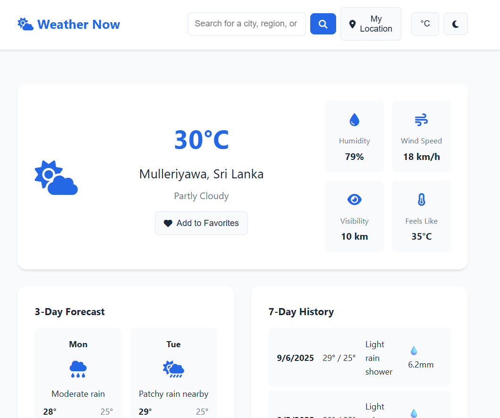
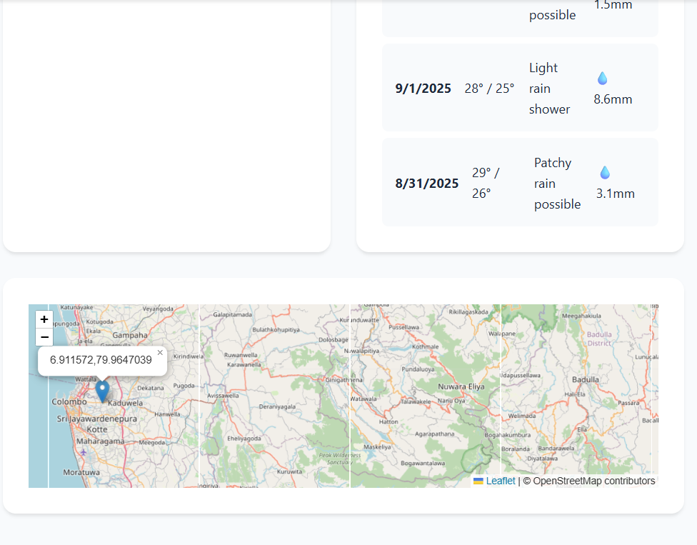
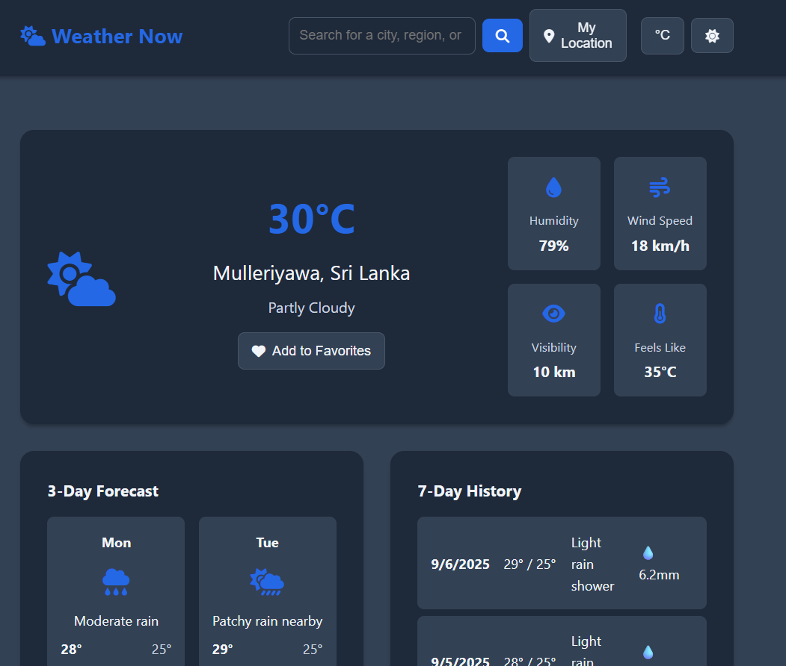

# Weather Application - Requirement Analysis Document

## Project Overview

**Project Name:** Weather Now - Personal Weather Dashboard  
**Version:** 1.0  
**Date:** September 2025  
**Developer:** Shan Dahanayaka  
**Course:** ICET - Web Development Final Project
**URL:** [Weather-now-web-application](https://smsdahanayaka.github.io/weather-now/)

## Executive Summary

Weather Now is a responsive web application that provides comprehensive weather information including current conditions, forecasts, historical data, and interactive mapping features. The application leverages the WeatherAPI.com service to deliver real-time weather data with a focus on user experience and accessibility.

## 1. Project Scope

### 1.1 Included Features

- Current weather display with detailed metrics (temperature, humidity, wind, visibility)
- 3-day weather forecast with visual indicators
- 7-day historical weather data
- Location-based services (GPS and manual search)
- Interactive map integration with clickable weather points
- Weather alerts and notifications system
- User preferences (metric/imperial units, light/dark themes)
- Favorites system for quick location access
- Responsive design supporting desktop, tablet, and mobile devices
- Cross-browser compatibility
- Performance optimization with caching

### 1.2 Out of Scope

- Real-time weather radar imagery
- Detailed hourly forecasts beyond 3 days

## 2. Functional Requirements

### 2.1 Core Weather Features

#### FR-001: Current Weather Display

**Description:** Display current weather conditions for selected location
**Priority:** High
**Acceptance Criteria:**

- Show temperature in Celsius/Fahrenheit
- Display weather description and appropriate icon
- Show humidity, wind speed, visibility, and "feels like" temperature
- Update data every 30 minutes or on user request
- Handle API failures gracefully with cached data

#### FR-002: Weather Forecast

**Description:** Provide 3-day weather forecast
**Priority:** High
**Acceptance Criteria:**

- Display next 3 days (excluding current day)
- Show high/low temperatures
- Include weather icons and descriptions
- Support unit conversion (metric/imperial)

#### FR-003: Historical Weather Data

**Description:** Show past 7 days weather information
**Priority:** Medium
**Acceptance Criteria:**

- Display previous 7 days of weather data
- Show temperature ranges and precipitation
- Format dates clearly
- Handle missing historical data gracefully

### 2.2 Location Services

#### FR-004: Location Search

**Description:** Allow users to search for weather by location
**Priority:** High
**Acceptance Criteria:**

- Support city, region, and country search
- Provide real-time search suggestions
- Handle invalid location queries
- Support coordinate-based searches (lat, lon)

#### FR-005: Geolocation Support

**Description:** Use browser geolocation for current position weather
**Priority:** High
**Acceptance Criteria:**

- Request user permission for location access
- Fallback to default location if permission denied
- Handle geolocation errors gracefully
- Provide accuracy within reasonable limits

### 2.3 Interactive Features

#### FR-006: Interactive Map

**Description:** Provide clickable map for weather location selection
**Priority:** Medium
**Acceptance Criteria:**

- Display OpenStreetMap with weather markers
- Allow click-to-search functionality
- Center map on selected location
- Show location popup with weather summary

#### FR-007: Favorites System

**Description:** Save frequently accessed locations
**Priority:** Low
**Acceptance Criteria:**

- Add/remove locations from favorites
- Quick access to favorite locations
- Persist favorites in local storage
- Maximum 10 favorite locations

### 2.4 User Interface Features

#### FR-008: Theme Customization

**Description:** Support light and dark theme modes
**Priority:** Medium
**Acceptance Criteria:**

- Toggle between light/dark themes
- Persist theme preference
- Smooth transition animations
- Maintain accessibility contrast ratios

#### FR-009: Unit Conversion

**Description:** Support metric and imperial units
**Priority:** High
**Acceptance Criteria:**

- Toggle between Celsius/Fahrenheit
- Convert wind speed (km/h ↔ mph)
- Convert visibility (km ↔ miles)
- Persist unit preference

## 3. Non-Functional Requirements

### 3.1 Performance Requirements

#### NFR-001: Page Load Time

**Target:** Initial page load < 3 seconds on standard broadband
**Measurement:** Browser DevTools Performance tab

#### NFR-002: API Response Time

**Target:** Weather data retrieval < 2 seconds
**Fallback:** Show cached data if API fails

#### NFR-003: Memory Usage

**Target:** < 50MB RAM usage on mobile devices
**Optimization:** Efficient DOM manipulation and data caching

### 3.2 Usability Requirements

#### NFR-004: Responsive Design

**Requirement:** Support screen sizes from 320px to 4K displays
**Breakpoints:**

- Mobile: 320px - 767px
- Tablet: 768px - 1023px
- Desktop: 1024px+

**Features Requiring Polyfills:**

- Geolocation API (built-in browser support)
- Local Storage (universal support)
- Fetch API (modern browser standard)

## 4. Technical Architecture

### 4.1 Frontend Technologies

- **HTML5:** Semantic markup and accessibility features
- **CSS3:** Grid/Flexbox layouts, custom properties, animations
- **JavaScript ES6+:** Async/await, modules, modern syntax
- **Leaflet.js:** Interactive mapping functionality

### 4.2 External APIs

- **WeatherAPI.com:** Primary weather data source
- **OpenStreetMap:** Map tile service via Leaflet

### 4.3 Data Storage

- **LocalStorage:** User preferences, favorites, cached weather data
- **No Backend:** Static hosting on GitHub Pages

## 5. Risk Analysis

### 5.1 Technical Risks

| Risk                  | Probability | Impact | Mitigation Strategy                        |
| --------------------- | ----------- | ------ | ------------------------------------------ |
| API Rate Limiting     | Medium      | High   | Implement caching, user rate limiting      |
| Browser Compatibility | Low         | Medium | Progressive enhancement, feature detection |
| Mobile Performance    | Medium      | Medium | Optimize images, minimize JavaScript       |
| API Service Downtime  | Low         | High   | Cache last successful response             |

### 5.2 User Experience Risks

| Risk                       | Probability | Impact | Mitigation Strategy                      |
| -------------------------- | ----------- | ------ | ---------------------------------------- |
| Slow Network Response      | High        | Medium | Loading indicators, cached data          |
| Location Permission Denied | Medium      | Low    | Fallback to default location             |
| Invalid Search Queries     | High        | Low    | Input validation, helpful error messages |

## 8. Constraints & Assumptions

### 8.1 Constraints

- Must use WeatherAPI.com for weather data
- No backend server or database
- Limited to client-side technologies
- Free API tier limitations (calls per month)

### 8.2 Assumptions

- Users have modern browsers with JavaScript enabled
- Stable internet connection for API requests
- Users will grant geolocation permissions when prompted
- WeatherAPI.com service remains stable and available

## Approval

**Document Prepared By:** Shan Dahanayaka  
**Date:** 2025-09-06  
**Course Instructor:** DR Nnroth  
**Project Status:** Ready for Deployment

---

_This document serves as the foundation for the Weather Now application development and will be updated as requirements evolve during the development process._
